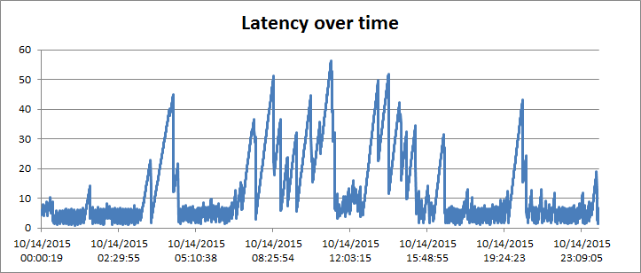
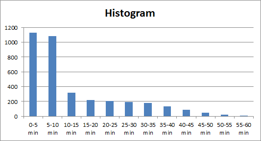
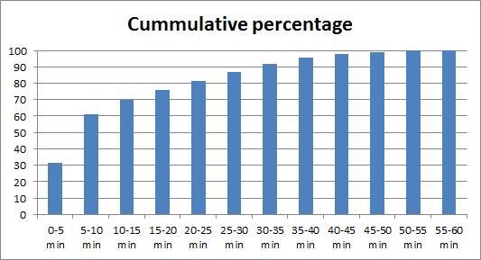

SPSearchIndexLiveliness
=======================

When to use it
--------------

If you're curious about the liveliness of SharePoint's search index and don't have
access to the administrative portal. Any SharePoint user with write access to a list 
can run SPSearchIndexLiveliness and continuously gauge how far behind the index is.

Liveliness changes over time and is especially important with search-driven 
applications.

How to use it
-------------

After compiling the solution, create a generic list anywhere the indexer have access 
to. Then run SPSearchIndexLiveliness as follows (username and password are for SharePoint
Online only):

```
# SPSearchIndexLiveliness.Console.exe webUrl listTitle pingInterval [username] [password]
%> .\SPSearchIndexLiveliness.Console.exe https://bugfree.sharepoint.com/sites/liveliness Pings 30 rh@bugfree.onmicrosoft.com password | tee Log.txt
```

This causes SPSearchIndexLiveliness to continuously print liveliness statistics
to the terminal and write the output to Log.txt.

Example output running against SharePoint Online:

```
Run     Replies    Current time           Most recent reply      Latency
4427	6258	   10/14/2015 00:00:19	  10/13/2015 23:55:55	 00:04:24
4428	6258	   10/14/2015 00:00:39	  10/13/2015 23:55:55	 00:04:44
4429	6258	   10/14/2015 00:00:58	  10/13/2015 23:55:55	 00:05:03
4430	6258	   10/14/2015 00:01:17	  10/13/2015 23:55:55	 00:05:22
4431	6258	   10/14/2015 00:01:34	  10/13/2015 23:55:55	 00:05:39
4432	6258	   10/14/2015 00:01:52	  10/13/2015 23:55:55	 00:05:57
4433	6258	   10/14/2015 00:02:11	  10/13/2015 23:55:55	 00:06:16
4434	6258	   10/14/2015 00:02:29	  10/13/2015 23:55:55	 00:06:34
4435	6258	   10/14/2015 00:02:51	  10/13/2015 23:55:55	 00:06:56
...
```

To help diagnose operational issues with search and/or your application, the
statistics gathered should be imported into a spreadsheet for further processing.

Here's a 24-hour latency over time graph for October 14, 2015. Given that SharePoint
Online has continous crawl enabled by default, working hour performance isn't ideal:



The minimum, maximum, and average latencies are 0.87, 56.43, and 12.93 minutes,
respectively.

Creating a histogram from the 3,612 measurements gives us a feel for the properbility 
distribution. Assuming data is representative of SharePoint Online performance, the 
distribution is useful for defining latency requirements:


 
From the histogram, here's the cumulative percentage:



Interacting with a queing-based system like SharePoint Search, requirements are 
best phrased (and verified) in terms of percentages and latency. For intance, a 
requirement may be that "80% of the search request must show content no older than 
25 minutes". In principle, we can only get to 100% by accepting an infinite latency.

Queing-based (asynchronous) systems are generally build to scale better than request/
reply-based (synchronous) systems. Forcing a asynchronous system to operate in 
synchronous mode generally leads to bad performance.

How it works
------------

Each iteration around, SPSearchIndexLiveliness adds an item to a list and queries
the list using SharePoint search. The search result contains all indexed
list elements within which the most recent is located. Latency is then computed 
as the difference between current time and creation time of the most recent 
item.

Supported platforms
-------------------

SharePoint 2013 on-prem and SharePoint Online.